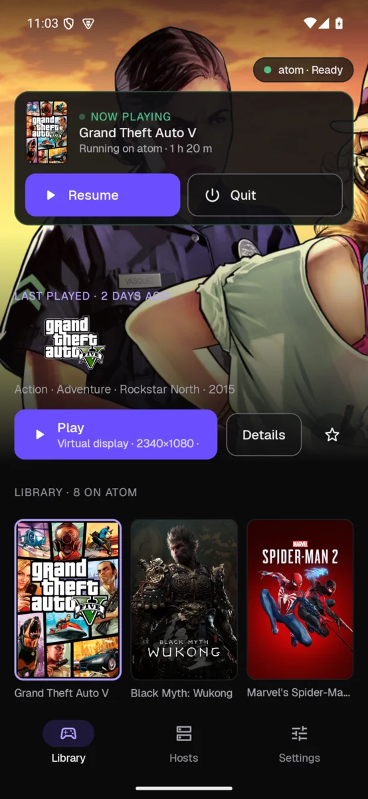
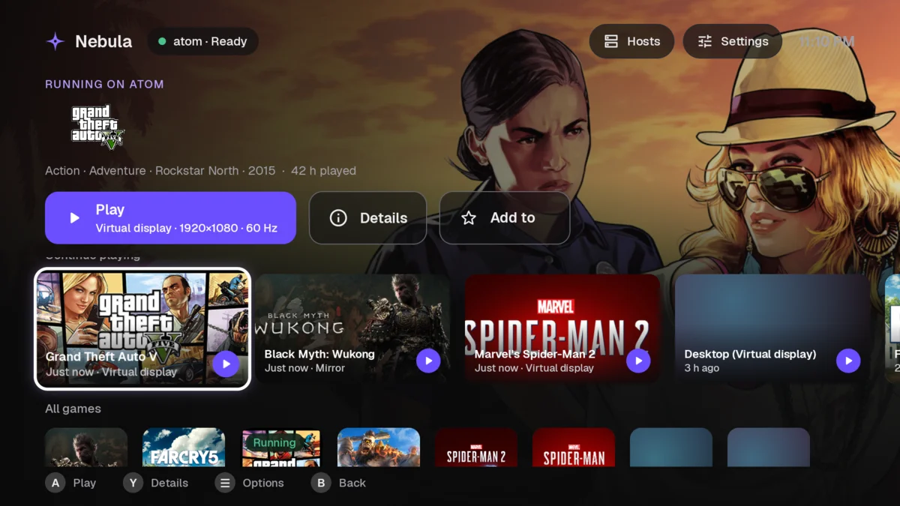
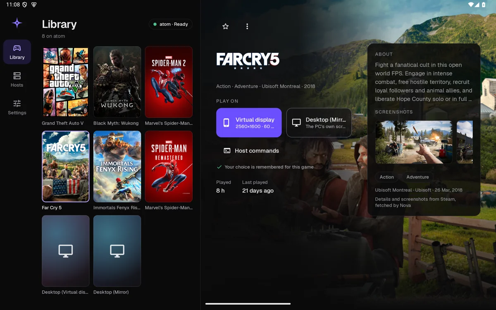
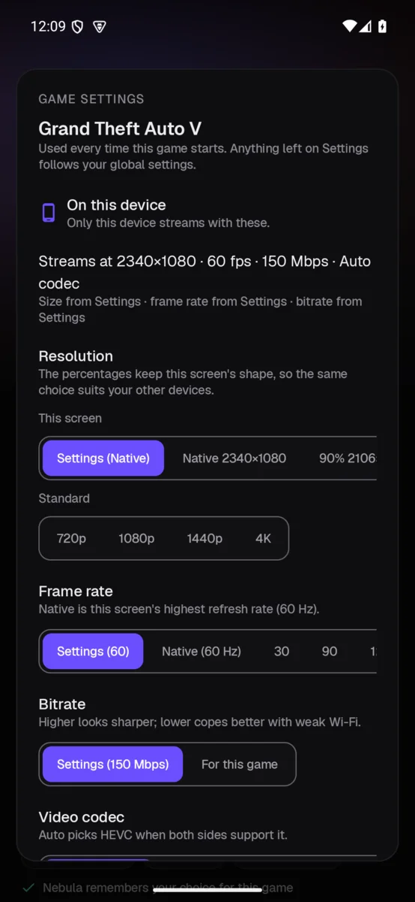
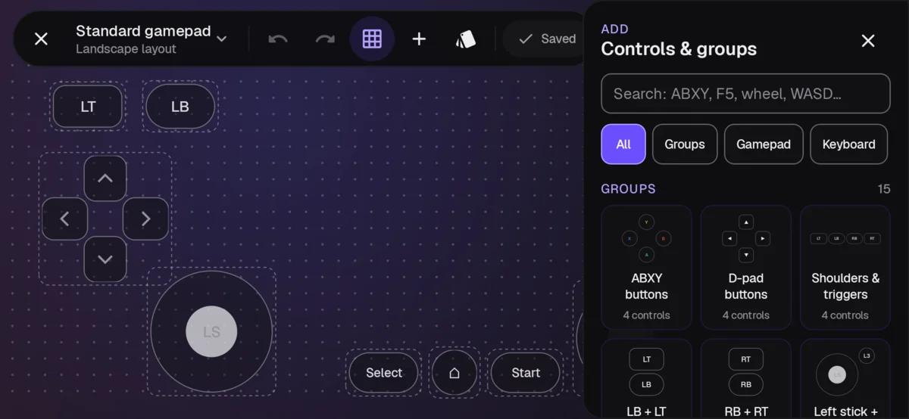
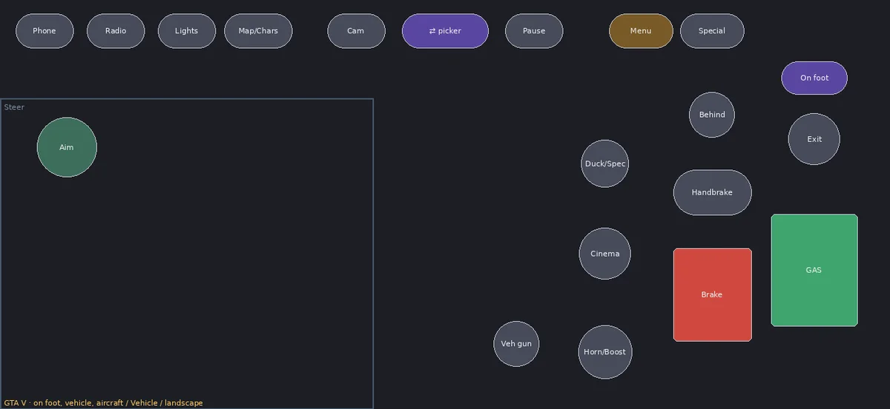

<div align="center">
  
  <h1 align="center">Nebula</h1>
  <h4 align="center">A console-style Android game streaming client for Nova and Moonlight hosts.</h4>
</div>

<div align="center">
  
  <a href="LICENSE.txt"></a>
  <a href="https://github.com/F-e-n-y-x/nova-host"></a>
  <a href="https://github.com/qiin2333/moonlight-vplus"></a>
</div>

<br/>

<div align="center">
  
</div>

Nebula plays the games on your PC from your phone, tablet or TV. It has a PS5-style game library
with the whole Moonlight V+ streaming engine underneath, and works best with
[Nova](https://github.com/F-e-n-y-x/nova-host) on the PC.

## Features

<table>
  <tr>
    <td width="34%"></td>
    <td><br/></td>
  </tr>
  <tr>
    <td></td>
    <td><br/></td>
  </tr>
</table>

**Library**
- 🎮 **Console-style launcher** — game art, logos and details fetched by the host; each game has
  **Play on Virtual display** and **Play on desktop (Mirror)**.
- 🏠 **Home styles** — Spotlight, Shelf or Auto, a **TV home** built for the remote, and a **tablet
  split view** (library left, game right).
- ▶️ **Now playing** — Resume or Quit the game running on the PC; a notification if you leave it running.
- ⚡ **Quick resume** — Quick Settings tile, home-screen widget and launcher shortcut that wake the PC
  and pick up where you left off.
- 🔎 **Finds your PC automatically**, pairs under a real name, and **wakes or sleeps the PC**.
- ⭐ **Favourites** pinned to the top.

**Streaming**
- 🎚️ **Per-game settings** — resolution (including "this screen" sizes like 75 %), frame rate,
  bitrate, codec, frame generation, upscaler and controls per game, plus the PC's frame-rate limit,
  FSR, sharpening and power mode when the host is Nova.
- 📶 **Adaptive bitrate** and a **connection test** that suggests a bitrate.
- 📐 **Live resolution switch** and **rotation** without reconnecting.
- ✨ **Frame generation** (60 → 120 fps) and **upscaling** (Sharpen, SGSR 1, FSR 1), with a device
  self-test and automatic off when the phone gets hot.
- 🧭 **Quick toggles** at the top of the stream menu — pin as many as you like, reorder them,
  works with a TV remote.
- 📊 **Stats overlay** — pick the metrics, drag it anywhere; line, card or graph.

**Input**
- 🖱️ **Virtual mouse** and a **local cursor**: the PC's pointer drawn on the device, so it moves instantly.
- ⌨️ **PC keyboard**, and an **auto keyboard** that opens when you tap a text field on the PC.
- 🔘 **Float ball** — drag it anywhere; tap for the menu, double tap for the keyboard, long press to
  show or hide the on-screen controls.
- 🕹️ **Controllers** — correct mapping, rumble and trigger rumble, gyro aiming, audio haptics.
- 🎤 **Microphone**, 📋 **two-way clipboard** and ⚙️ **host commands** you define in Nova.

**On-screen controls**
- 🎮 **Editor** — place, resize and snap buttons, sticks, triggers, touch zones and macros. A
  searchable **palette** with ready-made groups: ABXY, D-pad, shoulders and triggers, WASD, arrows,
  number row, F-keys, mouse buttons.
- 🔀 **Layout sets** — several layouts per game (e.g. on foot, vehicle, aircraft) with an on-screen
  **switch button**; switching releases everything you were holding.
- ➕ **Key combinations** — one button can send Shift+E or LB+RB, mixing gamepad, keyboard and mouse.
- 👆 **Touch zones** — swipe-to-look camera, floating sticks, fire-and-look; every finger handled on its own.
- 🌐 **Layout library** — the app ships with the standard controller only; add layouts and sets for any
  game from [nebula-layouts](https://github.com/F-e-n-y-x/nebula-layouts) (Browse layouts), or share
  your own as a file, code or QR code.

<p></p>

**Everywhere**
- 🩺 **Diagnostics** — controller test, stick calibration, capability report, log export.
- 🔄 **In-app updates** from GitHub releases (checksum and signature verified).
- 📱 Phone, tablet and Android TV, full D-pad support; every Moonlight V+ setting, with search.

## Install

Download `nebula-*.apk` from the [releases page](https://github.com/F-e-n-y-x/nebula/releases) and
open it on the device (allow "Install unknown apps" once). Android 8.0 or newer. Later updates
install from **Settings → About → Updates**.

Frame generation needs a Vulkan 1.1 GPU and your own copy of `Lossless.dll` from Lossless Scaling
(Steam): **Settings → Frame generation → Import Lossless.dll**. It is not included in the download.

## Build

```sh
git submodule update --init --recursive
./gradlew :nebula:assembleDebug
```

Release builds are signed with a key kept outside the repository. The frame-generation shader
DLL is proprietary: it is supplied locally (`nebulaLosslessDll=` in `local.properties`) and never
committed; public builds refuse to include it.

## Versioning

Numeric [semantic versioning](https://semver.org), tagged `nebula-vX.Y.Z`. Everything before
**1.0.0** is a pre-release.

## Credits & license

Developed by [Fenyx](https://github.com/F-e-n-y-x).
Nebula's streaming engine comes from [Moonlight V+](https://github.com/qiin2333/moonlight-vplus)
by qiin2333, built on [Moonlight for Android](https://github.com/moonlight-stream/moonlight-android)
— thank you. The original V+ readme is kept in [docs/vplus](docs/vplus/README_EN.md).

Licensed [GPL-3.0](LICENSE.txt).
