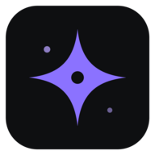
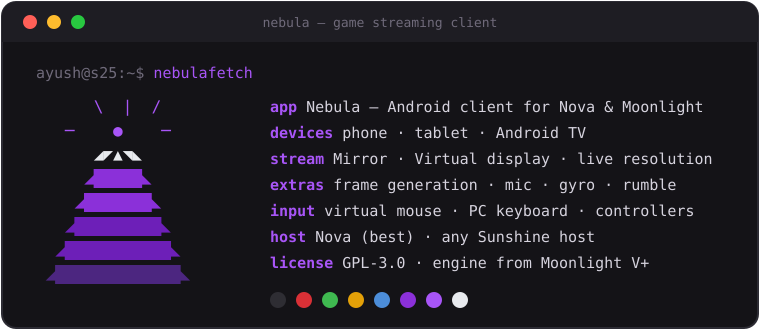

<div align="center">
  
  <h1 align="center">Nebula</h1>
  <h4 align="center">A console-style Android game streaming client for Nova and Moonlight hosts.</h4>
</div>

<div align="center">
  
  <a href="LICENSE.txt"></a>
  <a href="https://github.com/F-e-n-y-x/nova-host"></a>
  <a href="https://github.com/qiin2333/moonlight-vplus"></a>
</div>

<br/>

<div align="center">
  
</div>

Nebula plays the games on your PC from your phone, tablet or TV. It has a PS5-style game library
with the whole Moonlight V+ streaming engine underneath, and works best with
[Nova](https://github.com/F-e-n-y-x/nova-host) on the PC.

## Features

### Available now

**Library**
- 🎮 **Console-style launcher** — game art, logos and details fetched by the host; each game has
  **Play on Virtual display** and **Play on desktop (Mirror)**.
- 🔎 **Finds your PC automatically** and pairs under a real name (*Nebula from Ayush's S25 Ultra*).
- 😴 **Wake and sleep the PC** — tapping Play on a sleeping PC wakes it, waits, then starts the game.

**Streaming**
- 📐 **Live resolution switch** — change size and frame rate mid-stream without leaving the game,
  including sizes that match your screen exactly (no black bars) and desktop scaling.
- 🔄 **Rotation** — the stream turns with the phone without reconnecting.
- ✨ **Frame generation** (60 → 120 fps) and **upscaling** (Sharpen, SGSR 1, FSR 1), with a device
  self-test and automatic off when the phone gets hot.
- 📊 **Stats overlay** — pick the metrics, drag it anywhere; line, card or graph.

**Input**
- 🖱️ **Virtual mouse** — tap, two-finger right-click, drag, scroll and pinch; or direct touch.
- ⌨️ **PC keyboard** — F-keys, sticky Ctrl/Alt/Shift/Win, adjustable size and transparency.
- 🕹️ **Controllers** — correct stick and trigger mapping, rumble and trigger rumble, light bar,
  gyro aiming (controller or phone), and audio haptics.
- 🎤 **Microphone** and 📋 **two-way clipboard** with the PC.
- ⚙️ **Host commands** — run PC actions you define in Nova.

**Touch controls**
- 🎮 **On-screen controls editor** — place, resize and snap buttons, sticks, triggers and macros;
  per-game profiles; import V+ layouts.
- 👆 **Touch zones** — swipe-to-look camera, floating sticks, fire-and-look triggers; every finger
  handled on its own, so you can move, look and shoot at once.
- 🎯 **Ready-made layouts** — genre templates (touch shooter for controller or keyboard & mouse)
  and game layouts (GTA V), with a second fire button, drag-to-aim, sprint and run-lock built in.
- 📤 **Share layouts** — export as a file, a one-line code or a QR code, and import on any device
  with a preview and "fit to this screen".
- 🌐 **Layout library** — browse community layouts for any game or genre in the app
  (Profiles → Browse layouts), from [nebula-layouts](https://github.com/F-e-n-y-x/nebula-layouts).
  Made a good one? Tap *Share to library* in the app, or open a pull request there.

**Everywhere**
- ⭐ **Favourites** pinned to the top of the library, and a **diagnostics** hub (controller test,
  stick calibration, capability report, log export).
- 🔄 **Update checks** from releases, and links to both projects in About.
- 📱 Phone, tablet and Android TV layouts, full D-pad support.
- 🔧 Every Moonlight V+ setting, with search — and a test that fails the build if any setting shown
  does nothing.

### In progress

| Feature | Status |
|---|---|
| "Now playing" card and a notification when a game keeps running on the PC | 🔨 Building |
| TV home, Shelf and Auto home styles, tablet split view, quick-connect tile and widget | 🔨 Building |
| Adaptive bitrate and connection test | 🔨 Building |
| Local cursor (instant pointer drawn on the device) | 🔨 Building |
| Per-game presets (resolution, bitrate, frame generation, controls) | ⏸ Paused |

### Planned

Replay clips and an auto keyboard when a PC text field is focused.

## Install

Private builds only for now: install the latest `nebula-*.apk` from the releases page (or the one
your host shares). Android 8.0 or newer. Frame generation needs a Vulkan 1.1 GPU; the in-app
device check tells you if yours qualifies.

## Build

```sh
git submodule update --init --recursive
./gradlew :nebula:assembleDebug
```

Release builds are signed with a key kept outside the repository. The frame-generation shader
DLL is proprietary: it is supplied locally (`nebulaLosslessDll=` in `local.properties`) and never
committed; public builds refuse to include it.

## Versioning

Numeric [semantic versioning](https://semver.org), tagged `nebula-vX.Y.Z`. Everything before
**1.0.0** is a pre-release.

## Credits & license

Developed by [Fenyx](https://github.com/F-e-n-y-x).
Nebula's streaming engine comes from [Moonlight V+](https://github.com/qiin2333/moonlight-vplus)
by qiin2333, built on [Moonlight for Android](https://github.com/moonlight-stream/moonlight-android)
— thank you. The original V+ readme is kept in [docs/vplus](docs/vplus/README_EN.md).

Licensed [GPL-3.0](LICENSE.txt).
